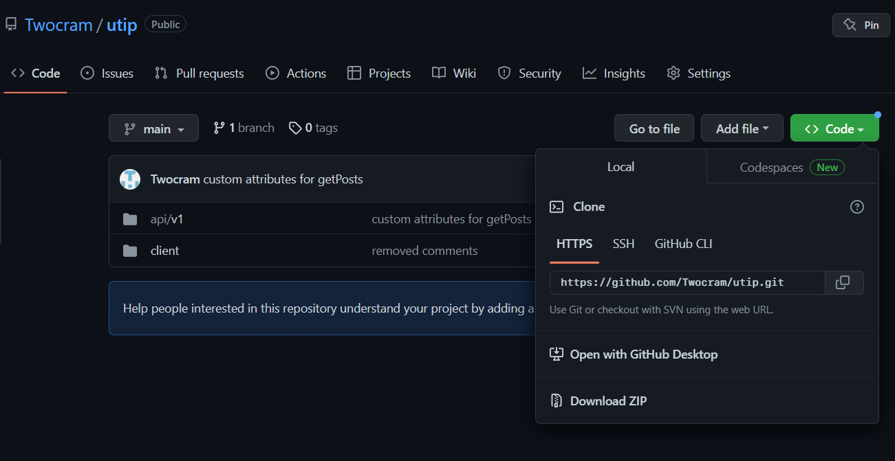

# Гайд по установке и настройке приложения

## Установка файлов

Чтобы скачать файлы приложения, необходимо нажать на кнопку Code и через консоль, либо ZIP установить файлы.

[]

Если использовать первый способ, то нужно перейти в необходимую директорию, открыть терминал и ввести следующее:

```sh
git clone https://github.com/Twocram/utip.git
```

После этого все файлы установятся в выбранной директории.

## Установка базы данных

В директории проекта: api/v1/src/db/ находится файл utip.sql. Его необходимо импортировать в вашу базу данных. В данном случае использовалось приложение phpmyadmin. В нём необходимо создать новую базу данных, далее перейти во вкладку import, выбрать файл utip.sql и нажать на кнопку "Import", которая находится в самом низу
[]

## Настройка базы данных

В файле db_connect.php, который располагается в директории api/v1/src/db/db_connect.php необходимо изменить значения переменных:

```php
define('SERVER', 'localhost'); // вместо localhost необходимо вписать свой домен
define('USER', 'root'); // вместо root необходимо вписать login для phpmyadmin
define('PASSWORD', ''); // вместо '' необходимо вписать пароль для phpmyadmin
define('DB_NAME', 'utip-test'); // вместо utip-test необходимо вписать название вашей БД
```

## Запуск проекта

После настроек необходимо запустить локальный сервер. Далее перейти по адресу:
http://localhost/utip-test/client/index.php
